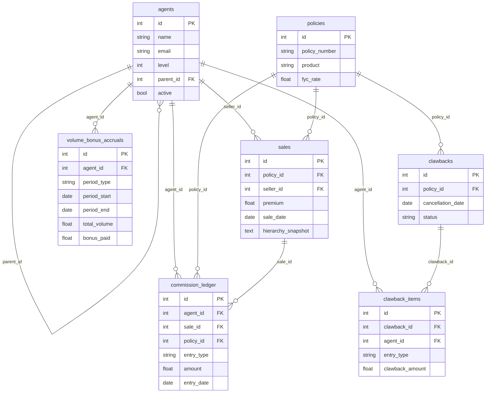

# My Contact Details
 - Name: Namrata Singh
 - college: IIT Patna

 


# Commission Calculation System

This project delivers a full-stack reference implementation of the insurance commission platform described in the assessment brief. It includes a Flask API backed by SQLite/SQLAlchemy, and a React + TypeScript frontend styled with Tailwind.

## Features

- Four-level agency hierarchy (Agent → Team Lead → Manager → Director) with parent/child management APIs.
- Policy sale capture with full hierarchy snapshots at the time of sale.
- Commission engine that books first year commissions, override payouts, and monthly/quarterly/annual volume bonuses using tier rules from the specification.
- Volume accrual ledger that keeps running totals per agent/period, enabling tier recalculations and audit-friendly reporting.
- Automated clawback workflows with preview, creation, approval, and denial. Approvals unwind FYC/override payouts and re-compute impacted volume bonuses.
- Analytics endpoints feeding dashboards & reports (KPI cards, trends, hierarchy summaries, volume bonus tables).
- Polished UI/UX: dashboards, sales management, hierarchy explorer, and clawback console with detailed impact modals.
- Pytest regression coverage for the commission engine and clawback adjustments.

## Feature Walkthrough

### Commission Engine & Volume Bonuses
- Each sale snaps the selling hierarchy and stores it with the transaction so historical payouts stay accurate even if the organisation changes later.
- First-year commissions (FYC) go to the seller while uplines receive fixed-rate overrides. These entries land in the `commission_ledger` table for a full audit trail.
- Monthly, quarterly, and annual volume bonuses are recalculated every time a sale posts. The engine maintains a `volume_bonus_accruals` row per agent/period, tracking cumulative volume, bonus rate, and cash already paid so only the delta is booked.
- Tiers mirror the brief (Bronze → Platinum). If volume crosses a threshold the delta between the old and new bonus is added immediately, so statements always reflect the latest tier.

### Clawback Management
- Cancellation previews recompute both direct payouts (FYC/override) and volume bonuses tied to the policy. The preview shows affected agents, entry types, and clawback amounts before anything is persisted.
- Approval writes negative ledger entries and adjusts the relevant accrual records so future bonus calculations start from the reduced volume. Denying the request simply marks it as `DENIED` for an audit trail.
- The Clawback UI lists current requests, provides impact KPIs, and lets reviewers inspect a detailed modal with period metadata (month/quarter/year and the volume delta that triggered recovery).

### Reporting & Analytics
- Reports and dashboard charts source their numbers from the ledger and accrual tables so user-facing analytics match finance data.
- The reports endpoint supports agent filtering, CSV export, and exposes both direct sales volume and bonus-adjusted volume per agent.
- Dashboard cards include period-over-period deltas, top earners, hierarchy snapshots, and revenue trends to give leadership a quick health check.

## Deployment

The application is deployed and can be accessed [commission-calculation-system](https://commission-calculation-system2.vercel.app/).

**Login Credentials:**

- **Username:** sarah@co.com  
- **Password:** pass


## Documentation

- [Setup Guide](docs/setup.md)
- [System Design](docs/system-design.md)
- [Database Schema](docs/database.md)
- [Database ERD](docs/erd.md)
- [Technical Architecture](docs/architecture.md)
- [User Guide](docs/user-guide.md)
- [OpenAPI Specification](backend/openapi.yaml) (also served at `GET /openapi.yaml`)

### Database ERD



## Project Structure

```
backend/
  api/            # Flask blueprints (agents, sales, reports, clawbacks, auth)
  core/           # DB + auth helpers
  models/         # SQLAlchemy models
  services/       # Business logic (commission engine, clawbacks, reports, tier rules)
  tests/          # Pytest suite
frontend/
  src/            # React app (pages, components, API client)
```

The repository includes a sample SQLite database (`backend/commission.db`). `core.db.init_db()` creates any missing tables/columns at startup, so running the backend once is enough to initialise a fresh environment.

## Prerequisites

- Python 3.11+
- Node.js 18+

## Backend Setup

```bash
cd backend
python -m venv venv
source venv/bin/activate # Windows: venv\Scripts\activate
pip install -r requirements.txt
```

Environment variables:

| Variable | Purpose | Default |
|----------|---------|---------|
| `COMMISSIONS_AUTH_SECRET` | JWT signing secret | `change-me-please` |
| `COMMISSIONS_TOKEN_TTL` | Token lifetime in days | `2` |

You can export them locally or provide a `.env` for your process manager.

Run the API:

```bash
python app.py
```

The server listens on `http://localhost:5002`.

### Database Notes

- The default SQLite file is `backend/commission.db`.
- `init_db()` performs lightweight schema evolution (adds the new `sales.hierarchy_snapshot` and `clawback_items.meta` columns if they are missing). If you started from an older schema you only need to restart the app once.
- Sample agents can be seeded via `python -m seeds.seed`.

### Tests

```bash
cd backend
pytest
```

The suite uses an in-memory SQLite database, so it is safe to run repeatedly.

## Frontend Setup

```bash
cd frontend
npm install
npm run dev
```

The app expects the API at `http://localhost:5002` by default (see `frontend/.env`). Adjust `VITE_API_URL` if you run the backend elsewhere.

To build for production:

```bash
npm run build
```

## Key Assumptions

- Volume bonus tiers apply to the aggregated production of each agent's downline (seller + managers). The bonus is re-evaluated for monthly, quarterly, and annual periods whenever a sale posts or a clawback is approved.
- Clawback factors follow the provided grace-period rule. A cancellation recovers the proportional FYC/override amounts and recomputes the impacted volume bonuses by subtracting the policy's premium from the original period accrual.
- Volume bonuses are paid immediately on sale via ledger entries, and clawbacks write negative ledger entries so the audit trail stays complete.
- JWT authentication suffices for this assessment. In production you should rotate the signing key and integrate with an identity provider.

## Useful Commands

| Command | Description |
|---------|-------------|
| `python app.py` | Run backend with hot reload |
| `pytest` | Execute backend unit tests |
| `npm run dev` | Start frontend (Vite) |
| `npm run lint` | Run ESLint across the frontend |
| `npm run typecheck` | TypeScript project check |

## Next Steps
- I can create a hierarchy-based system for adding agents. For example, when I login as a Director, I can add Managers, Team Leads, and Agents. Similarly, when I log in as a Manager, I can add Team Leads and Agents
- Expand pytest coverage to services such as reports and agent management.
- Add integration tests hitting the Flask blueprints.
- Containerise with Docker Compose for single-command bootstrapping.
- Replace local auth with OAuth or SSO provider.
- Hardening: rate limiting, structured logging, and background jobs for heavy recalculations.
