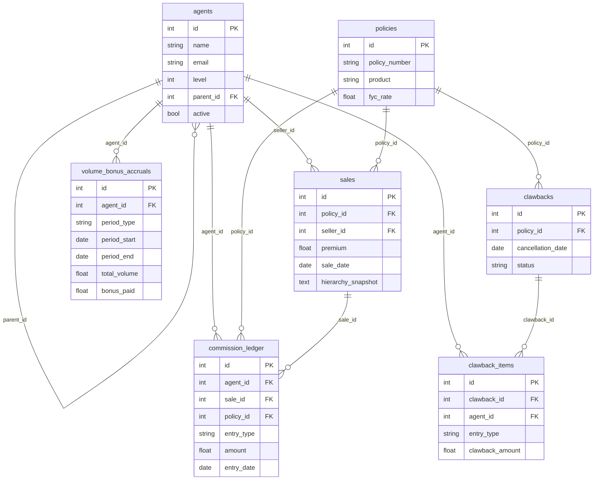

# Database Schema ERD

The diagram below captures the core entities that power the commission calculation platform, along with the cardinality between tables.

### Notes
- `sales.hierarchy_snapshot` stores a JSON array of the hierarchy at the time of sale so historic payouts remain auditable even if reporting lines change later.
- `commission_ledger.entry_date` corresponds to the SQLAlchemy `date` column in `CommissionLedger`; renamed in the diagram to avoid clashing with the Mermaid keyword `date`.
- `volume_bonus_accruals` enforces uniqueness on `(agent_id, period_type, period_start)` to ensure one record per period window.
- `clawback_items` capture every amount reversed when a cancellation is approved, referencing both the original clawback request and the impacted agent.
