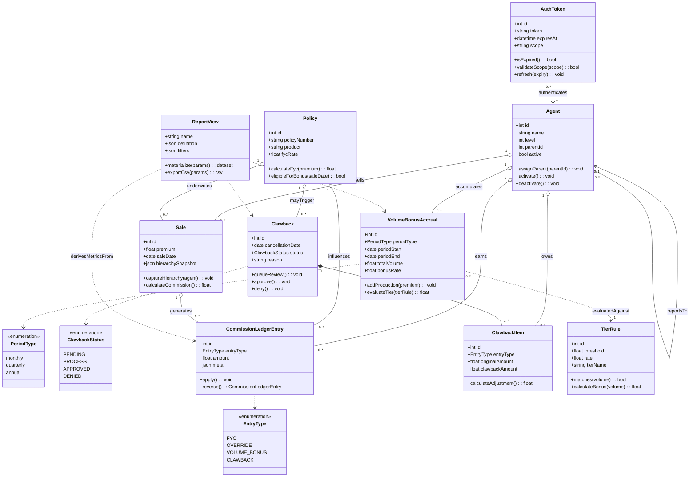

# System Design

## 1. Requirements

### Functional Requirements
- Support secure agent and administrator authentication with JWT-based sessions.
- Maintain a multi-level agent hierarchy, including onboarding, profile updates, and activation state changes.
- Capture insurance policies and associated sales, including customer metadata and the agent hierarchy snapshot at the time of sale.
- Calculate and persist first-year commissions, overrides, and volume bonuses in a unified ledger for every sale event.
- Provide dashboards and reports that summarise production, commissions, bonuses, and clawbacks with period filtering and CSV export.
- Manage clawback workflows from cancellation intake through approval, reversing the appropriate ledger entries and notifying affected agents.
- Expose RESTful APIs consumed by the React frontend, enforcing authorization and validation at the service layer.

### Non-Functional Requirements
- Ensure data integrity with transactional writes and idempotent service operations.
- Protect sensitive information via salted password hashes, HTTPS termination, and secret rotation policies.
- Deliver responsive UI interactions (<250 ms API median) for typical mid-size agency datasets.
- Scale horizontally by swapping SQLite for a managed SQL database and containerising the backend/frontend.
- Preserve auditability through immutable ledger entries, timestamped status changes, and traceable metadata.
- Maintain observability with structured logging, health checks, and instrumentation hooks for future APM integration.

## 2. Objects

- **Agent**: Represents a salesperson or leader in the hierarchy; tracks identity, level, parent relationship, authentication hash, and status flags.
- **Policy**: Stores product metadata and commission rates tied to a unique policy number.
- **Sale**: Records a policy sale, the selling agent, financial details (premium, date), customer context, and the captured hierarchy snapshot used for downstream calculations.
- **CommissionLedgerEntry**: Immutable log entry capturing monetary movements (`FYC`, `OVERRIDE`, `VOLUME_BONUS`, `CLAWBACK`) with references to agents, sales, and policies plus JSON metadata.
- **VolumeBonusAccrual**: Aggregates production volume and bonus payouts per agent and period, enabling tier evaluation and payout scheduling.
- **Clawback**: Represents a policy cancellation event with reason, effective date, notes, and workflow status (`PENDING`,`PROCESS`, `APPROVED`, `DENIED`).
- **ClawbackItem**: Breaks a clawback into per-agent, per-entry adjustments, referencing the original ledger amounts to reverse.
- **TierRule**: Defines thresholds and rates for volume bonus tiers; interpreted by the commission engine during payout calculations.
- **AuthToken**: Encapsulates JWT payloads (agent id, expiry) and underpins request authorization across protected routes.
- **ReportView**: Logical projection used by the reporting services to deliver aggregated metrics, charts, and exports.

## 3. UML Diagram

### Class Diagram

The class diagram captures the core domain entities, key enumerations, and how policy sales, ledger entries, bonuses, and clawbacks relate back to agents and their hierarchy snapshot.

